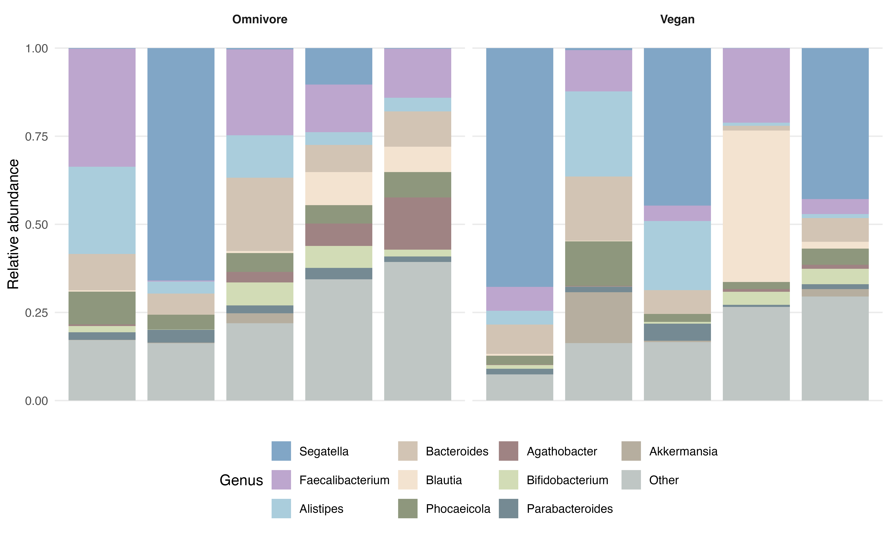
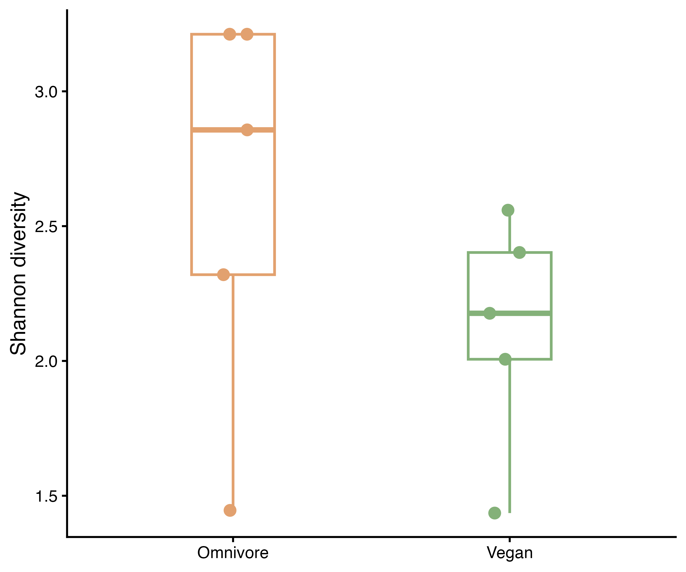
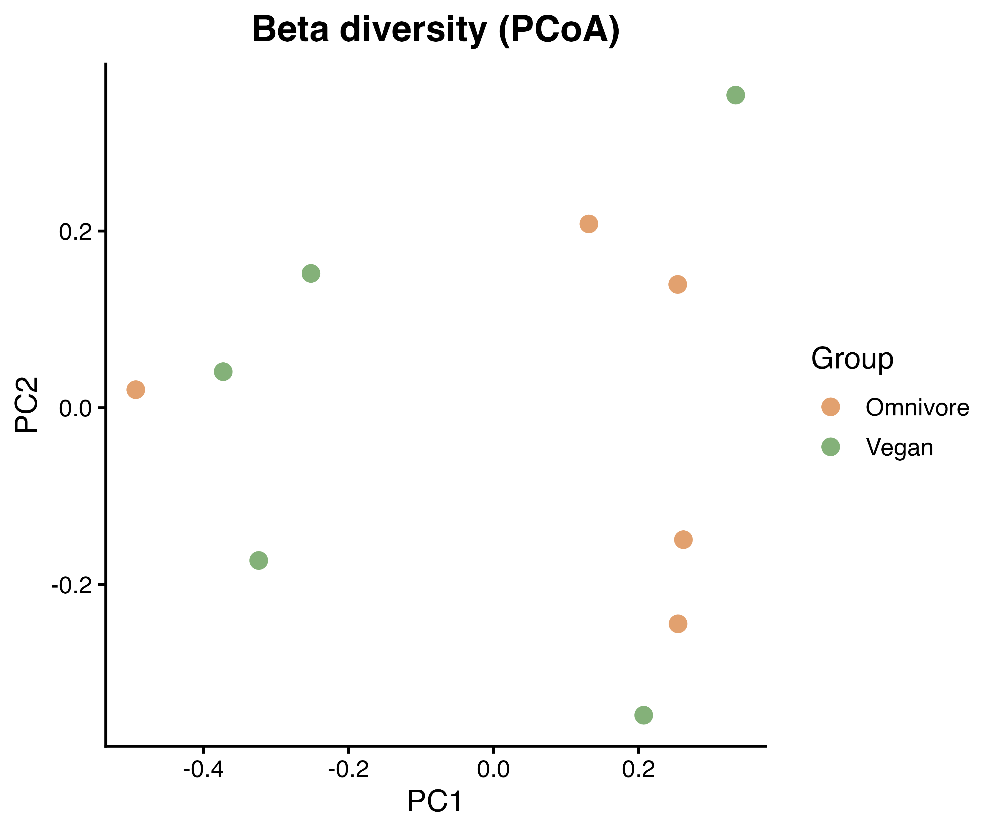
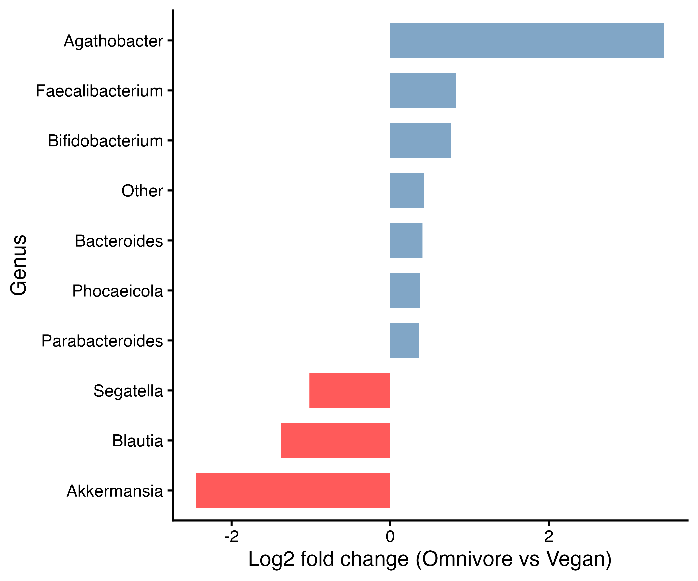

# BINF-6110-Assign3

## Introduction

The human gut microbiome plays a fundamental role in host physiology, including metabolism, immune regulation, and nutrient processing (Ramakrishna, 2013). Diet is one of the most influential environmental factors shaping microbial composition, as different dietary patterns provide distinct substrates that can selectively promote specific microbial taxa (Sheflin et al., 2017). For instance, plant-based diets are typically rich in fiber and have been associated with enrichment of short-chain fatty acid–producing bacteria, whereas omnivorous diets may support a broader range of microbial functions due to more diverse nutrient inputs (Fackelmann et al., 2025; Muralidharan et al., 2019).

Despite these associations, the gut microbiome exhibits substantial inter-individual variability, making it difficult to identify consistent microbial signatures linked to dietary patterns (Kerimi et al., 2020; Lampe et al., 2013) . In addition, recent studies suggest that strain-level variation within species may further obscure diet-associated patterns, as different strains can exhibit distinct functional capacities (Bianchetti et al., 2023).

This study builds on previously published metagenomic datasets examining gut microbiomes of individuals with different dietary habits. In particular, diet can select for functionally distinct strains of *Prevotella copri*, highlighting the importance of considering both taxonomic and functional variation in microbiome studies (Filippis et al., 2019).

In this study, shotgun metagenomic sequencing data were analyzed to compare gut microbiome profiles between omnivore and vegan individuals. Taxonomic classification was performed using Kraken2, a k-mer-based method that enables rapid and scalable assignment of sequencing reads to reference genomes (Wood et al., 2019). While Kraken2 offers computational efficiency compared to alignment-based methods, it relies on reference databases and may leave a fraction of reads unclassified. To comprehensively assess microbiome differences, both diversity metrics and taxonomic composition were analyzed, highlighting the strengths and limitations of each approach.

## Methods

Shotgun metagenomic sequencing data were obtained from publicly available datasets derived from studies investigating the relationship between diet and gut microbiome composition (Filippis et al., 2019). These datasets include samples from individuals with different habitual diets, including omnivores and vegans, allowing for comparative microbiome analysis.

Raw sequencing reads were downloaded using SRA Toolkit (v3.0.9) (SRA Toolkit Development Team, n.d.) with prefetch, followed by conversion to FASTQ format using fasterq-dump. Paired-end reads were retained for downstream analysis.

Taxonomic classification was performed using Kraken2 (v2.1.6) (Wood et al., 2019) with a standard reference database (Standard-8). Reads were processed in paired-end mode with default parameters using four computational threads. Kraken2 assigns reads based on exact k-mer matches, enabling fast classification; however, its performance depends on database completeness, and unclassified reads may represent novel or underrepresented taxa (Wood et al., 2019).

Kraken2 report files were imported into R (v4.5.1) for downstream analysis. Data processing and visualization were performed using the tidyverse package collection, including ggplot2, dplyr, and tidyr (Wickham et al., 2019). Taxa were aggregated at the genus level, and relative abundances were calculated by normalizing read counts within each sample. Low-abundance taxa were grouped into an “Other” category to improve visualization clarity.

Alpha diversity was calculated using the Shannon index with the vegan package (Oksanen et al., 2001), which accounts for both richness and evenness. Differences between dietary groups were assessed using a Wilcoxon rank-sum test. Beta diversity was evaluated using Bray-Curtis dissimilarity and visualized using principal coordinates analysis (PCoA). Differential abundance was assessed by calculating log2 fold changes in mean relative abundance between groups. Due to limited sample size, differential abundance results were interpreted as exploratory rather than statistically conclusive.

## Results

**Figure 1.** Genus-level taxonomic composition of gut microbiome samples from omnivore and vegan groups. Relative abundance of dominant genera is shown for each sample, illustrating substantial inter-individual variability within and between dietary groups.

Genus-level taxonomic composition revealed substantial inter-individual variability within both dietary groups (Figure 1). Dominant genera such as *Segatella*, *Faecalibacterium*, and *Bacteroides* were observed across samples; however, their relative abundances varied considerably. While certain taxa appeared more prominent in specific samples, no consistent genus-level pattern clearly distinguished omnivore from vegan groups, indicating that microbial composition is highly heterogeneous.

**Figure 2.** Alpha diversity (Shannon index) of gut microbiome samples in omnivore and vegan groups. Each point represents an individual sample, and boxplots summarize group distributions. No statistically significant difference was observed between groups.

Alpha diversity analysis showed a trend toward higher Shannon diversity in omnivore samples compared to vegan samples (Figure 2). Omnivore samples also exhibited greater variability in diversity values, whereas vegan samples appeared more tightly clustered. However, this difference was not statistically significant (Wilcoxon rank-sum test: W = 19, p = 0.2222), suggesting that the observed trend does not represent a consistent difference between dietary groups.

**Figure 3.** Beta diversity of gut microbiome samples visualized by principal coordinates analysis (PCoA) based on Bray–Curtis dissimilarity. Each point represents a sample colored by dietary group, showing substantial overlap between groups.

Beta diversity analysis using PCoA based on Bray-Curtis dissimilarity did not reveal clear separation between omnivore and vegan samples (Figure 3). Samples from both groups overlapped substantially in ordination space, indicating that overall community composition is not strongly structured by diet. Instead, variation between individuals appears to be the dominant driver of community differences.

**Figure 4.** Differential abundance of genera between omnivore and vegan groups, shown as log2 fold change. Positive values indicate higher abundance in omnivore samples, while negative values indicate higher abundance in vegan samples. Differences were modest and not consistently observed across samples.

Differential abundance analysis identified several genera with differences in relative abundance between dietary groups (Figure 4). Genera such as *Agathobacter*, *Faecalibacterium*, and *Bifidobacterium* showed relatively higher abundance in omnivore samples, whereas *Akkermansia* and *Blautia* were more abundant in vegan samples. However, these differences were modest in magnitude and not consistently observed across all samples, suggesting that diet-associated effects at the genus level are limited in this dataset.

## Discussion

This study investigated the relationship between diet and gut microbiome composition using shotgun metagenomic data. Across all analyses, dietary group exhibited only a modest influence on microbiome structure, with inter-individual variability emerging as the dominant factor.

The absence of a clear genus-level signature distinguishing omnivore and vegan samples is consistent with previous studies showing that individual-specific factors often outweigh dietary effects in shaping the microbiome (De Filippo et al., 2010). While diet provides an important ecological driver, its impact may be subtle and influenced by additional variables such as lifestyle, host genetics, and long-term dietary history.

Importantly, diet-associated differences may be more evident at the strain level rather than the genus level, particularly for *Prevotella copri* (Filippis et al., 2019). The analysis showed that individuals with different dietary habits harbor distinct *P. copri* strains with different functional capacities, including variation in carbohydrate metabolism and biosynthetic pathways (Filippis et al., 2019). This suggests that the lack of strong taxonomic differences observed in this study may reflect limitations of genus-level analysis rather than absence of true biological effects.

Alpha diversity results showed a non-significant trend toward higher diversity in omnivore samples. Previous work has reported mixed findings, with some studies linking plant-based diets to increased diversity due to higher fiber intake (Seel et al., 2023), while others found no consistent differences (Miao et al., 2022). The lack of statistical significance in this study likely reflects both limited sample size and the inherent variability of microbiome data.

Similarly, beta diversity analysis did not reveal clear clustering by dietary group, consistent with reports that strong separation is often only observed under controlled dietary conditions (Iizuka et al., 2025). This suggests that free-living dietary patterns may not be sufficient to produce distinct microbiome configurations.

Differential abundance analysis highlighted several taxa of potential biological relevance. *Akkermansia*, enriched in vegan samples, is associated with mucin degradation and metabolic health (Tingler & Engevik, 2025). In contrast, *Faecalibacterium* and *Agathobacter*, more abundant in omnivore samples, are known butyrate producers that contribute to gut homeostasis (Popova et al., 2025; Yang et al., 2024). The presence of these taxa across both groups suggests functional redundancy within the microbiome, where different organisms may perform similar metabolic roles.

However, the observed differences were modest and inconsistent, underscoring key limitations of this study. The small sample size reduces statistical power, while the use of Kraken2 introduces dependence on reference databases, potentially limiting taxonomic resolution (Wood et al., 2019). Additionally, summary metrics such as Shannon diversity may obscure finer-scale differences in community structure.

In conclusion, this analysis suggests that dietary effects on the gut microbiome are subtle relative to inter-individual variability in this dataset. These findings align with previous work emphasizing the importance of strain-level and functional analyses in microbiome research and highlight the need for larger, controlled studies to better resolve diet-microbiome interactions.

## References

Bianchetti, G., De Maio, F., Abeltino, A., Serantoni, C., Riente, A., Santarelli, G., Sanguinetti, M., Delogu, G., Martinoli, R., Barbaresi, S., Spirito, M. D., & Maulucci, G. (2023).   
Unraveling the Gut Microbiome–Diet Connection: Exploring the Impact of Digital Precision and Personalized Nutrition on Microbiota Composition and Host Physiology.   
Nutrients, 15(18), 3931.   
https://doi.org/10.3390/nu15183931  

De Filippo, C., Cavalieri, D., Di Paola, M., Ramazzotti, M., Poullet, J. B., Massart, S., Collini, S., Pieraccini, G., & Lionetti, P. (2010).   
Impact of diet in shaping gut microbiota revealed by a comparative study in children from Europe and rural Africa.   
Proceedings of the National Academy of Sciences, 107(33), 14691–14696.   
https://doi.org/10.1073/pnas.1005963107   

Fackelmann, G., Manghi, P., Carlino, N., Heidrich, V., Piccinno, G., Ricci, L., Piperni, E., Arrè, A., Bakker, E., Creedon, A. C., Francis, L., Capdevila Pujol, J., Davies, R., Wolf, J., Bermingham, K. M., Berry, S. E., Spector, T. D., Asnicar, F., & Segata, N. (2025).   
Gut microbiome signatures of vegan, vegetarian and omnivore diets and associated health outcomes across 21,561 individuals.   
Nature Microbiology, 10(1), 41–52.   
https://doi.org/10.1038/s41564-024-01870-z   

Filippis, F. D., Pasolli, E., Tett, A., Tarallo, S., Naccarati, A., Angelis, M. D., Neviani, E., Cocolin, L., Gobbetti, M., Segata, N., & Ercolini, D. (2019).   
Distinct Genetic and Functional Traits of Human Intestinal Prevotella copri Strains Are Associated with Different Habitual Diets.   
Cell Host & Microbe, 25(3), 444-453.e3.   
https://doi.org/10.1016/j.chom.2019.01.004  

Iizuka, K., Yanagi, K., Deguchi, K., Ushiroda, C., Yamamoto-Wada, R., Ishihara, T., & Naruse, H. (2025). 
The Alpha and Beta Diversities of Dietary Patterns Differed by Age and Sex in Young and Middle-Aged Japanese Participants.   
Nutrients, 17(13), 2205.   
https://doi.org/10.3390/nu17132205  

Kerimi, A., Kraut, N. U., da Encarnacao, J. A., & Williamson, G. (2020).   
The gut microbiome drives inter- and intra-individual differences in metabolism of bioactive small molecules. 
Scientific Reports, 10(1), 19590.   
https://doi.org/10.1038/s41598-020-76558-5  

Lampe, J. W., Navarro, S. L., Hullar, M. A. J., & Shojaie, A. (2013).   
Inter-individual differences in response to dietary intervention: Integrating omics platforms towards personalised dietary recommendations.   
Proceedings of the Nutrition Society, 72(2), 207–218.   
https://doi.org/10.1017/S0029665113000025  

Miao, Z., Du, W., Xiao, C., Su, C., Gou, W., Shen, L., Zhang, J., Fu, Y., Jiang, Z., Wang, Z., Jia, X., Zheng, J.-S., & Wang, H. (2022).   
Gut microbiota signatures of long-term and short-term plant-based dietary pattern and cardiometabolic health: A prospective cohort study.   
BMC Medicine, 20(1), 204.   
https://doi.org/10.1186/s12916-022-02402-4  

Muralidharan, J., Galiè, S., Hernández-Alonso, P., Bulló, M., & Salas-Salvadó, J. (2019).   
Plant-Based Fat, Dietary Patterns Rich in Vegetable Fat and Gut Microbiota Modulation.   
Frontiers in Nutrition, 6.  
https://doi.org/10.3389/fnut.2019.00157  

Oksanen, J., Simpson, G. L., Blanchet, F. G., Kindt, R., Legendre, P., Minchin, P. R., O’Hara, R. B., Solymos, P., Stevens, M. H. H., Szoecs, E., Wagner, H., Barbour, M., Bedward, M., Bolker, B., Borcard, D., Borman, T., Carvalho, G., Chirico, M., De Caceres, M., … Weedon, J. (2001).   
vegan: Community Ecology Package (p. 2.7-3) [Dataset].   
https://doi.org/10.32614/CRAN.package.vegan  

Popova, A., Rācenis, K., Brīvība, M., Saksis, R., Saulīte, M., Šlisere, B., Berga-Švītiņa, E., Oļeiņika, K., Saulīte, A. J., Seilis, J., Kroiča, J., Čerņevskis, H., Pētersons, A., Kloviņš, J., Lejnieks, A., & Kuzema, V. (2025).     
Reduced butyrate-producing bacteria and altered metabolic pathways in the gut microbiome of immunoglobulin A nephropathy patients.   
Scientific Reports, 15(1), 28011.   
https://doi.org/10.1038/s41598-025-13629-5  

Ramakrishna, B. S. (2013).   
Role of the gut microbiota in human nutrition and metabolism.   
Journal of Gastroenterology and Hepatology, 28(S4), 9–17.   
https://doi.org/10.1111/jgh.12294  

Seel, W., Reiners, S., Kipp, K., Simon, M.-C., & Dawczynski, C. (2023).   
Role of Dietary Fiber and Energy Intake on Gut Microbiome in Vegans, Vegetarians, and Flexitarians in Comparison to Omnivores—Insights from the Nutritional Evaluation (NuEva) Study.   
Nutrients, 15(8), 1914.   
https://doi.org/10.3390/nu15081914. 

Sheflin, A. M., Melby, C. L., Carbonero, F., & Weir, T. L. (2017).     
Linking dietary patterns with gut microbial composition and function.   
Gut Microbes, 8(2), 113–129.   
https://doi.org/10.1080/19490976.2016.1270809  

SRA Toolkit Development Team. (n.d.).   
SRA Toolkit (Version 3.0.9) [Computer software]. Retrieved       https://trace.ncbi.nlm.nih.gov/Traces/sra/sra.cgi?view=software. 

Tingler, A. M., & Engevik, M. A. (2025).     
Breaking down barriers: Is intestinal mucus degradation by Akkermansia muciniphila beneficial or harmful? 
Infection and Immunity, 93(9), e00503-24.   
https://doi.org/10.1128/iai.00503-24 

Wickham, H., Averick, M., Bryan, J., Chang, W., McGowan, L., François, R., Grolemund, G., Hayes, A., Henry, L., Hester, J., Kuhn, M., Pedersen, T., Miller, E., Bache, S., Müller, K., Ooms, J., Robinson, D., Seidel, D., Spinu, V., … Yutani, H. (2019).   
Welcome to the Tidyverse.   
Journal of Open Source Software, 4(43), 1686.   
https://doi.org/10.21105/joss.01686  

Wood, D. E., Lu, J., & Langmead, B. (2019).     
Improved metagenomic analysis with Kraken 2.   
Genome Biology, 20(1), 257.   
https://doi.org/10.1186/s13059-019-1891-0 

Yang, C., Wu, J., Yang, L., Hu, Q., Li, L., Yang, Y., Hu, J., Pan, D., & Zhao, Q. (2024).     
Altered gut microbial profile accompanied by abnormal short chain fatty acid metabolism exacerbates   nonalcoholic fatty liver disease progression.   
Scientific Reports, 14(1), 22385.    
https://doi.org/10.1038/s41598-024-72909-8   

